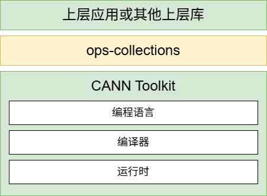

# ops-collections

## 一、什么是ops-collections

### ops-collections介绍
ops-collections是基于昇腾硬件的高性能容器模板库，提供运行在NPU上的static_map、dynamic_map、set等容器。利用最新的SIMT并发能力，支持对容器的批量插入、查找等操作，提升整个系统的能力。

### 软件架构



**核心特性：**
- 支持多种容器在NPU上的高性能执行
- 该库仅有头文件组成，使用时仅需引用头文件
- 使用风格接近STL库

### 目录结构

```
ops-collections
├── docs           //文档文件
├── doxygen        //Doxygen配置文件
├── include        //存放公共头文件
│   ├── detail     //容器实现细节
│   │   ├── extent              //extent具体实现
│   │   ├── hash_functions      //哈希函数实现
│   │   ├── open_addressing     //开放寻址法实现
│   │   ├── pair                //pair具体实现
│   │   ├── probing_scheme      //probing_scheme具体实现
│   │   ├── static_map          //static_map具体实现
│   │   └── storages            //存储相关实现
│   ├── utility                 //通用函数、工具
│   ├── bucket_storage.h        //BucketStorage容器头文件
│   ├── counter_storage.h       //CounterStorage容器头文件
│   ├── extent.h                //Extent头文件
│   ├── hash_functions.h        //哈希函数对外头文件
│   ├── macros.h                //宏定义
│   ├── pair.h                  //Pair头文件
│   ├── probing_scheme.h        //探测策略头文件
│   ├── static_map.h            //StaticMap容器对外头文件
│   ├── static_map_ref.h        //StaticMapRef设备端引用头文件
│   └── storage.h               //Storage基类头文件
├── scripts        //脚本文件存放目录
│   └── build.sh   //构建脚本
└── tests          //测试代码
    ├── common     //通用测试工具
    ├── performance//性能测试
    │   └── static_map
    ├── static_map //StaticMap单元测试
    └── utility    //基础组件测试
```

## 二、环境构建

### 硬件要求
Atlas 950系列产品及后续支持SIMT能力的昇腾系列产品

### 快速安装CANN软件

本节提供快速安装CANN软件的示例命令，更多安装步骤请参考[详细安装指南](#cann详细安装指南)。

#### 安装前准备
离线安装时，请单击[获取链接](https://www.hiascend.com/developer/download/community/result?module=cann)下载CANN软件包，并上传到安装环境任意路径。

#### 安装CANN
请使用CANN9.0.0-beta.2及以上版本，其他版本暂不支持。
```shell
chmod +x Ascend-cann-toolkit_${VERSION}_linux-$(arch).run  # 其中${VERSION}表示对应的CANN版本
./Ascend-cann-toolkit_${VERSION}_linux-$(arch).run --install
```

#### 安装后配置
配置环境变量脚本set_env.sh，当前安装路径以${HOME}/Ascend为例。
```
source ${HOME}/Ascend/ascend-toolkit/set_env.sh
```

### CANN详细安装指南
开发者可访问[昇腾文档-昇腾社区](https://www.hiascend.com/document)->CANN社区版->软件安装，查看CANN软件安装引导，根据机器环境、操作系统和业务场景选择后阅读详细安装步骤。

### 测试依赖

ops-collections 的功能测试依赖于 **Catch2** 测试框架。

#### Catch2 版本要求
- **最低版本**：v3.5.4
- **推荐版本**：v3.5.4 或更高版本

#### 自动安装
构建脚本会自动下载并安装 Catch2 框架，无需手动安装。在首次运行功能测试时，脚本会自动从 GitHub 克隆 Catch2 v3.5.4 到本地 `3rdparty/Catch2` 目录。

#### 手动安装（可选）
如果需要手动安装 Catch2，可以执行以下命令：
```sh
git clone --depth 1 --branch v3.5.4 https://github.com/catchorg/Catch2.git 3rdparty/Catch2
```

**注意**：功能测试和性能测试是可选的，如果不需要运行测试，则无需安装 Catch2 框架。ops-collections 的核心功能作为纯头文件库，不依赖任何第三方库。

## 三、快速上手

### 运行ops-collections示例

#### 下载
```sh
git clone https://gitcode.com/cann/ops-collections.git
```
您可自行选择需要的分支。

#### 编译

注意：ops-collections正式功能通过头文件提供，不提供so或bin等编译产物，因此无需编译。为了方便用户快速了解其使用方法，ops-collections提供了一些调用示例，这部分示例需要编译后才能运行。

编译加速库，设置加速库环境变量：
```sh
cd ops-collections
bash scripts/build.sh -b
```

#### 执行功能测试用例

运行所有功能测试用例：
```sh
bash scripts/build.sh -r
```

运行个别测试用例（`<test-name>`替换为具体测试名称）：
```sh
bash scripts/build.sh -r --test-name <test-name> 
```

#### 执行性能测试用例

构建性能测试：
```sh
bash scripts/build.sh -p
```

生成的性能测试执行文件在`/build/performance`文件夹下

运行所有性能测试：
```sh
bash scripts/build.sh -rp
```

## 四、API介绍

### API概述

#### 容器类

| 容器名称 | 功能说明 | 主要特性 |
|---------|---------|---------|
| StaticMap | 静态哈希表容器，提供高效的键值对存储和查询功能 | 基于开放寻址法实现；支持批量操作；支持同步/异步模式；键值类型≤8字节 |

#### 核心API

| API名称 | 功能说明 | 详细文档 |
|---------|---------|---------|
| Insert / InsertAsync | 批量插入键值对到哈希表 | [API文档 - Insert](docs/API文档和使用示例.md#32-insert---插入键值对) |
| InsertIf / InsertIfAsync | 批量条件插入键值对到哈希表 | [API文档 - InsertIf](docs/API文档和使用示例.md#33-insertif---条件插入键值对) |
| InsertOrAssign / InsertOrAssignAsync | 批量插入或更新键值对到哈希表 | [API文档 - InsertOrAssign](docs/API文档和使用示例.md#34-insertorassign---插入或更新键值对) |
| InsertAndFind / InsertAndFindAsync | 批量插入并查找键值对，同时返回查找结果和插入标志 | [API文档 - InsertAndFind](docs/API文档和使用示例.md#35-insertandfind---插入并查找键值对) |
| Find / FindAsync | 批量查找键对应的值 | [API文档 - Find](docs/API文档和使用示例.md#36-find---查找键对应的值) |
| FindIf / FindIfAsync | 批量条件查找键对应的值 | [API文档 - FindIf](docs/API文档和使用示例.md#37-findif---条件查找键对应的值) |
| Contains / ContainsAsync | 批量检查键是否存在 | [API文档 - Contains](docs/API文档和使用示例.md#38-contains---检查键是否存在) |
| ContainsIf / ContainsIfAsync | 批量条件检查键是否存在 | [API文档 - ContainsIf](docs/API文档和使用示例.md#39-containsif---条件检查键是否存在) |
| Erase / EraseAsync | 批量删除键值对 | [API文档 - Erase](docs/API文档和使用示例.md#310-erase---删除键值对) |
| ForEach / ForEachAsync | 遍历匹配槽位并执行回调 | [API文档 - ForEach](docs/API文档和使用示例.md#311-foreach---遍历匹配槽位并执行回调) |
| Clear / ClearAsync | 清空哈希表 | [API文档 - Clear](docs/API文档和使用示例.md#312-clear---清空map) |
| Count | 批量统计键存在的数量 | [API文档 - Count](docs/API文档和使用示例.md#313-count---统计键存在的数量) |
| Capacity | 获取哈希表容量 | [API文档 - Capacity](docs/API文档和使用示例.md#314-capacity---获取容量) |
| Data | 获取数据指针 | [API文档 - Data](docs/API文档和使用示例.md#315-data---获取数据指针) |

#### 辅助组件

| 组件名称 | 功能说明 | 使用示例 |
|---------|---------|---------|
| LinearProbing | 线性探测策略，解决哈希冲突 | `aclco::LinearProbing<aclco::murmurhash3_32<Key>>` |
| BucketStorage | 桶式存储管理器，负责内存分配和初始化 | 自动使用，无需手动配置 |
| Pair | 键值对结构，用于存储和传递键值数据 | `aclco::MakePair(key, value)` |
| Extent | 容量表示类，支持静态和动态容量 | `aclco::Extent<size_t>(10000)` |
| Storage | 存储策略类，定义桶大小 | `aclco::Storage<5>` |
| Hash Functions | 哈希函数集合 | `aclco::murmurhash3_32<Key>` |

### API文档

本项目使用Doxygen开源工具来自动生成API文档。Doxygen作为C++代码的文档生成工具，通过代码中特定格式的注释来生成HTML文档，该项目提取了`Readme.md`和`include`文件夹中的内容。

运行以下命令，在`docs/html`中生成html文件：
```sh
bash scripts/build.sh -doc
```
打开`html`文件夹中的`index.html`文件，即为文档主页。

常用Doxygen注释命令清单如下：
| 命令                     | 说明            |
|-----------------------|-------------------|
|`@brief`                  |函数或类的简短描述|
|`@param`                  |描述函数参数     |
|`@return`/ `@returns`     |描述函数返回值|
|`@tparam`        |描述模板参数|
|`@note`          |强调重要说明，如性能、使用注意|
|`@warning`       |警告用户潜在风险，如类型限制、内存访问|
|`@see`/ `@sa`    |交叉引用其他函数或类|

## 五、项目集成

ops-collections是一个纯头文件库，无需编译即可使用。只需在项目中包含头文件：

```cpp
#include "static_map.h"
```

详细使用方法请参考 [API文档和使用示例](docs/API文档和使用示例.md)。

## 六、文档导航

- **[API文档和使用示例](docs/API文档和使用示例.md)** - 详细的API接口说明、参数说明、使用示例
- **[开发指导](docs/开发指导.md)** - 环境构建、开发指南、性能测试

## 七、参与贡献

- **[提交问题](https://gitcode.com/cann/ops-collections/issues)** - 报告bug、请求新功能、提出改进建议
- **[贡献代码](https://gitcode.com/cann/ops-collections/contribute)** - 欢迎Fork项目并提交Pull Request

## 八、更多资源

[CANN社区版文档](https://www.hiascend.com/document/detail/zh/CANNCommunityEdition/83RC1alpha002/index/index.html)

## 九、许可证
[CANN Open Software License Agreement Version 2.0](LICENSE)