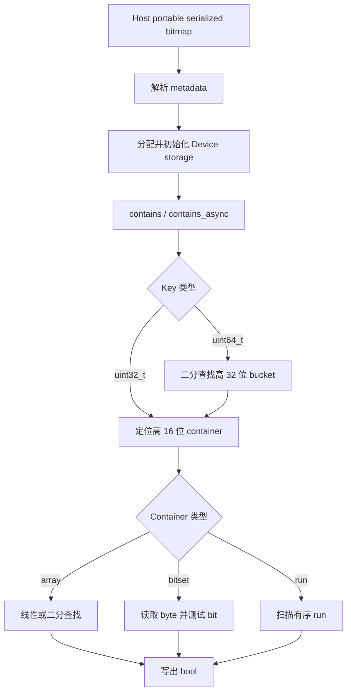
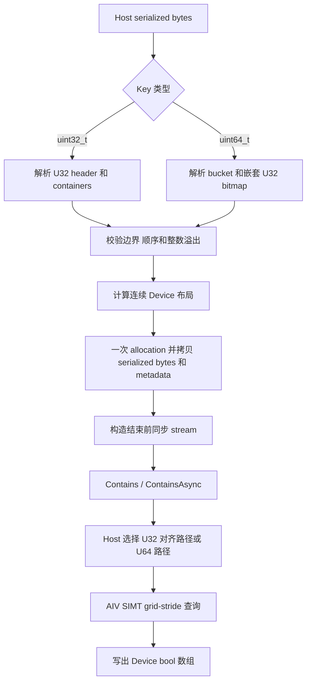
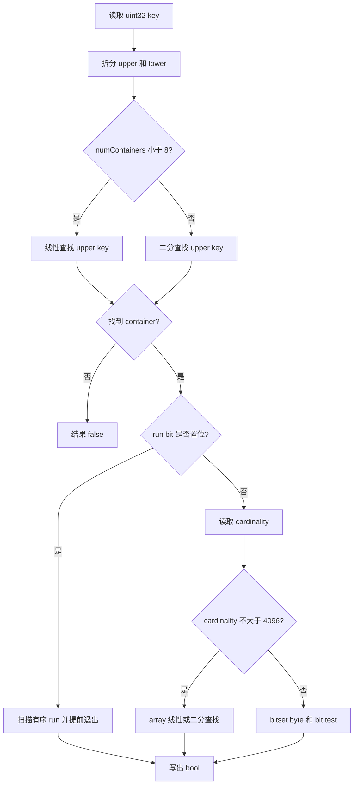

# RoaringBitmap 容器设计文档

# 1. 背景介绍

## 1.1 RoaringBitmap 功能背景

Roaring Bitmap 是面向整数集合的压缩数据结构。对于 32 位 key，它按高 16 位对数据分组，
再根据低 16 位数据的分布选择 array、bitset 或 run container，在压缩率和成员查询效率之间
取得平衡。Portable serialization 将 container 及其索引元数据保存为固定字节格式，可以在
Host 侧交换，也可以由 Device Kernel 直接读取。

本任务设计只读、面向批量查询的 Device 容器。Host 侧在构造阶段解析一次 portable
serialized bitmap，Device 侧保留 serialized bytes 和查询元数据；`Contains` 或
`ContainsAsync` 接收 Device key 数组，并按输入顺序输出 bool 结果。本任务不包含插入、删除、
动态更新以及从无序 key 数组生成 bitmap 的能力。

## 1.2 参考实现分析

本文参考 cuCollections 的 `cuco::experimental::roaring_bitmap` CUDA 实现。相关模块如下：

| 模块 | 作用 |
| --- | --- |
| `include/cuco/roaring_bitmap.cuh` | owning 容器公共接口 |
| `include/cuco/roaring_bitmap_ref.cuh` | non-owning Device 查询视图 |
| `detail/roaring_bitmap/roaring_bitmap_storage.cuh` | serialized bytes 和 metadata 的存储管理 |
| `detail/roaring_bitmap/roaring_bitmap_impl.cuh` | U32/U64 membership 查询算法 |
| `detail/roaring_bitmap/util.cuh` | portable 格式解析、对齐 load 和公共元数据 |

cuCollections 在 Host 侧读取 portable serialized bitmap，计算 serialized size、key 数量、
container offset 和 U64 bucket metadata，再将 serialized bytes 及查询 metadata 放入 Device
存储。批量 `contains_async` 使用 `cub::DeviceTransform::Transform`，每个 CUDA thread 独立
处理一个输入 key。

U32 查询先用 key 的高 16 位定位 container，再用低 16 位进入 array、bitset 或 run 查询。
小规模表采用线性查找，其余场景采用二分查找。U64 查询先使用高 32 位定位 bucket，再以低
32 位复用 U32 查询。查询直接读取 serialized representation，不在查询前展开为普通 key 集合。

## 1.3 参考实现流程图



本任务保持上述 portable 格式和 membership 语义，将 CUDA storage、bulk transform 和 Device
查询映射为 C++ Host 管理与 Ascend C AIV SIMT Kernel。

# 2. 需求分析

## 2.1 功能需求

### 2.1.1 需求拆解

| 编号 | 需求项 | 设计要求 |
| --- | --- | --- |
| R1 | key 类型 | 支持 `uint32_t` 和 `uint64_t` |
| R2 | U32 格式 | 支持 array、bitset、run container，以及有/无 offset table 的合法 portable 格式 |
| R3 | U64 格式 | 支持高 32 位 bucket key 加嵌套 U32 bitmap 的 portable 64-bit 格式 |
| R4 | 生命周期 | 支持构造、析构、移动构造和移动赋值，禁止复制拥有同一 Device allocation |
| R5 | 查询 | 支持同步 `Contains`、异步 `ContainsAsync` 和 Device 单 key 查询视图 |
| R6 | 泛化 | `keyNum` 支持 0、任意正整数和非 block 整数倍，输入 key 不要求有序 |
| R7 | 非法输入 | 有界构造需要拒绝截断、非法 cookie、无序 key、非法 offset 和整数溢出 |
| R8 | 精度 | U32/U64 查询结果与参考结果逐元素二进制一致 |

容器本身不携带 Tensor shape。批量输入视为一维 `Key[keyNum]`，输出视为一维
`bool[keyNum]`，输出顺序与输入顺序一致。

## 2.2 接口需求

`Contains` 接口顺序为：

```cpp
void Contains(void* keys, void* outputValues, Extent keyNum, aclrtStream stream);
```

本设计保持参数顺序和含义不变，并使用 const 限定表达只读输入：

```cpp
void Contains(void const* keys, void* outputValues,
              Extent keyNum, aclrtStream stream) const;
```

cuCollections 使用 `first`、`last` 两个 Device iterator 表达输入范围。由于目标公共接口没有
对应的 Device iterator，本设计使用“Device 起始地址 + 元素数量”表达相同语义。

接口能力要求如下：

| 接口类别 | 要求 |
| --- | --- |
| 构造 | 接收 Host 侧 portable serialized bitmap，可选传入可用字节数和 ACL stream |
| 析构 | 释放容器拥有的 Device allocation |
| 同步查询 | `Contains` 提交查询并在返回前同步指定 stream |
| 异步查询 | `ContainsAsync` 只提交查询，调用方负责输入、输出和容器生命周期 |
| 状态查询 | 提供 `Size`、`Empty`、`Data`、`SizeBytes` 和 `GetAllocator` |
| Device view | 提供 non-owning `RoaringBitmapRef<Key>`，支持 Device 单 key `Contains` |

## 2.3 性能需求

性能测试覆盖 U32/U64 bitmap 的构造、析构和批量 Contains。查询数据量应根据测试环境的
Host 和 Device 内存容量配置，避免构造超出可用内存的查询集合。

## 2.4 外部组件依赖

| 组件 | 用途 | 依赖性质 |
| --- | --- | --- |
| cuCollections `roaring_bitmap` | 接口、格式解析和查询算法参考 | 设计参考，不是运行时依赖 |
| Roaring portable serialization | U32/U64 输入格式 | 数据格式约束 |
| ACL Runtime | Device 内存、H2D 拷贝、stream 和同步 | 运行时依赖 |
| Ascend C SIMT | AIV Kernel、线程索引和 GM 访问 | Kernel 依赖 |
| ops-collections `Extent` / `Allocator` | 查询数量和 Device allocation 抽象 | 仓内公共组件 |

## 2.5 适配模块

| 模块 | 设计职责 |
| --- | --- |
| `include/roaring_bitmap.h` | owning 容器公共接口和生命周期 |
| `include/roaring_bitmap_ref.h` | Device non-owning view 和 membership 查询 |
| `include/detail/roaring_bitmap/format.h` | portable 格式解析、边界校验和 metadata 定义 |
| `include/detail/roaring_bitmap/roaring_bitmap.inl` | Host 初始化、Device 内存管理和 Kernel dispatch |
| `include/detail/roaring_bitmap/kernels.h` | U32/U64 AIV SIMT Kernel |

# 3. 总体设计思想

本方案采用“Host 解析一次、Device 紧凑存储、每个 SIMT thread 独立查询”的总体设计。

```text
Host portable serialized bitmap
    -> 格式解析与合法性校验
    -> serialized bytes + metadata 一次 Device allocation
    -> H2D 初始化
    -> U32/U64 AIV SIMT 批量查询
    -> Device bool output
```

Host 侧负责格式理解、边界检查、内存布局和 Kernel 选择；Device 侧只执行确定的 membership
查询，不动态分配内存、不修改 bitmap，也不重复解析完整 serialized stream。

## 3.1 算子分析

### 3.1.1 数学公式

设 bitmap 表示整数集合 `B`，输入 key 为 `x`，成员查询定义为：

```text
contains(x, B) = true,  x in B
                 false, x not in B
```

对长度为 `N` 的输入数组：

```text
outputValues[i] = contains(keys[i], B), 0 <= i < N
```

该运算只产生布尔结果，不涉及浮点计算、舍入或误差容限。

### 3.1.2 支持数据类型

| 对象 | 支持数据类型 | 说明 |
| --- | --- | --- |
| U32 bitmap key | `uint32_t` | 对应 U32 portable serialization |
| U64 bitmap key | `uint64_t` | 对应 portable 64-bit bucket 格式 |
| 查询输出 | `bool` | 每个输入 key 对应一个成员查询结果 |
| 其他 key 类型 | 不支持 | 由编译期 `static_assert` 拒绝 |

### 3.1.3 支持形状

RoaringBitmap 不是 Tensor 算子，不保存多维 shape。`keys` 和 `outputValues` 均按一维连续数组
解释，逻辑 shape 分别为 `[keyNum]` 和 `[keyNum]`。`keyNum` 可以为 0 或任意正整数，不要求
与 SIMT thread 数量或 AIV block 数量整除。

## 3.2 Portable 格式和查询算法

U32 key 拆分为：

```text
upper = value >> 16
lower = value & 0xffff
```

`upper` 用于定位 container，`lower` 用于 container 内查询。U32 portable 格式字段均为
little-endian：

1. 无 run 格式的 cookie 为 `12346`，其后为 `uint32_t numContainers`。
2. 有 run 格式的 cookie 低 16 位为 `12347`，高 16 位为 `numContainers - 1`。
3. 有 run 格式的 cookie 后保存 run-container bitmap。
4. 每个 key/cardinality 表项由两个 `uint16_t` 组成，cardinality 存储为 `cardinality - 1`。
5. 非 run 且 cardinality 不大于 4096 时使用 array，否则使用 8192 字节 bitset。
6. run container 保存有序 `(start, length)`，查询区间为 `[start, start + length]`。
7. 无 run，或者有 run 且 container 数不少于 4 时，serialized data 包含 offset table；
   有 run 且 container 数少于 4 时，由 Host 计算 container offset。

U64 portable 格式为：

```text
uint64_t numBuckets
repeat numBuckets times:
    uint32_t bucketKey
    serialized U32 roaring bitmap
```

U64 key 拆分为：

```text
bucketKey   = value >> 32
bucketValue = value & 0xffffffff
```

查询先在 bucket descriptor 中二分 `bucketKey`，命中后将 `bucketValue` 交给同一套 U32
membership 逻辑。

## 3.3 分层架构

```text
public API: RoaringBitmap / RoaringBitmapRef
        |
        +-- Host parser and validation
        |       +-- U32 metadata
        |       +-- U64 bucket descriptors
        |
        +-- Device ownership and Kernel dispatch
        |
        +-- AIV SIMT query
                +-- array / bitset / run
                +-- U64 bucket binary search
```

## 3.4 Ascend 方案流程图



# 4. 详细设计（required）

## 4.1 使能方式

RoaringBitmap 作为 ops-collections 头文件容器提供，调用方包含公共头文件并使用 `aclco`
命名空间：

```cpp
#include "roaring_bitmap.h"

aclco::RoaringBitmap<uint32_t> bitmap(serializedData, serializedBytes,
                                      allocator, stream);
bitmap.Contains(deviceKeys, deviceOutput, keyNum, stream);
```

构造输入位于 Host，`keys` 和 `outputValues` 位于 Device。U32/U64 在模板实例化阶段分流，
不在单个查询内部判断 key 类型。

## 4.2 接口设计

### 4.2.1 Owning 容器接口

```cpp
template <typename Key,
          typename Extent = aclco::Extent<size_t>,
          typename Allocator = aclco::DefaultAllocator<uint8_t>>
class RoaringBitmap {
public:
    explicit RoaringBitmap(void const* bitmap,
                           Allocator const& allocator = {},
                           aclrtStream stream = nullptr);

    RoaringBitmap(void const* bitmap, size_t bitmapBytes,
                  Allocator const& allocator = {},
                  aclrtStream stream = nullptr);

    RoaringBitmap(RoaringBitmap const&) = delete;
    RoaringBitmap& operator=(RoaringBitmap const&) = delete;
    RoaringBitmap(RoaringBitmap&& other);
    RoaringBitmap& operator=(RoaringBitmap&& other);
    ~RoaringBitmap();

    void Contains(void const* keys, void* outputValues,
                  Extent keyNum, aclrtStream stream) const;
    void ContainsAsync(void const* keys, void* outputValues,
                       Extent keyNum, aclrtStream stream) const;

    uint64_t Size() const noexcept;
    bool Empty() const noexcept;
    uint8_t const* Data() const noexcept;
    uint64_t SizeBytes() const noexcept;
    Allocator GetAllocator() const;
    RoaringBitmapRef<Key> Ref() const noexcept;
};
```

仅传 `bitmap` 指针的构造重载用于对齐 cuCollections 的使用方式。该重载无法获知 Host buffer
的实际长度，只适用于完整、可信的 serialized bitmap。带 `bitmapBytes` 的重载执行有界解析，
用于文件、网络数据或其他需要防止越界读取的输入。

### 4.2.2 Device Ref 接口

```cpp
template <typename Key>
class RoaringBitmapRef;
```

`RoaringBitmapRef<uint32_t>` 和 `RoaringBitmapRef<uint64_t>` 保存 Device serialized bytes、
metadata、U64 bucket descriptor 等 non-owning 指针，并提供 Device 单 key `Contains`、`Size`、
`Empty`、`Data` 和 `SizeBytes`。Ref 不分配、不释放内存，其生命周期不得超过 owning 容器及
相关异步任务。

### 4.2.3 参数和异常语义

| 参数 | 方向 | 位置 | 语义和约束 |
| --- | --- | --- | --- |
| `bitmap` | 输入 | Host | portable serialized bitmap 起始地址，不得为 null |
| `bitmapBytes` | 输入 | Host | 可用字节数，用于有界解析 |
| `keys` | 输入 | Device GM | `Key[keyNum]` 起始地址，`keyNum > 0` 时不得为 null |
| `outputValues` | 输出 | Device GM | `bool[keyNum]` 起始地址，`keyNum > 0` 时不得为 null |
| `keyNum` | 输入 | Host | 查询数量；有符号 `Extent::ValueType` 不得为负 |
| `stream` | 输入 | Host | 构造、查询和同步使用的 ACL stream |

异常策略如下：

1. 非法 portable 格式、负 `keyNum` 或正数量的 null Device 指针抛出
   `std::invalid_argument`。
2. Device allocation 失败抛出 `std::bad_alloc`。
3. ACL 调用失败转换为包含操作名称的运行时异常。
4. `keyNum == 0` 时不启动 Kernel，`keys` 和 `outputValues` 可以为 null。
5. `Key` 不是 `uint32_t` 或 `uint64_t` 时由编译期 `static_assert` 拒绝。

## 4.3 Host 侧设计

### 4.3.1 解析与校验

`ParseRoaringBitmap<Key>` 在 Host 上执行以下步骤：

1. 检查 `bitmap` 非 null，读取 little-endian cookie 或 U64 bucket 数量。
2. 根据有界或无界 reader 解析 header、run bitmap、key/cardinality 表和 offset table。
3. 校验 container/bucket 数量、key 严格递增以及 key count 累加不溢出。
4. 解析每个 container 的类型和字节范围，校验 offset 位于 header 之后、单调且内容不越界。
5. 计算 serialized size、key 数量和 Device metadata。
6. U64 为每个嵌套 U32 bitmap 生成 bucket key、byte offset 和 U32 metadata。

reader 使用逐字节 little-endian 读取，不依赖 Host 指针对齐和 Host endian。所有 size 加法和
乘法均进行溢出检查。

### 4.3.2 Device 内存布局

U32 使用以下布局：

```text
+----------------------+------------------------+
| serialized bytes     | aligned Metadata32     |
+----------------------+------------------------+
^ Data()
```

设 serialized bytes 大小为 `S`，则：

```text
metadataOffset = AlignUp(S, alignof(Metadata32))
allocationBytes = metadataOffset + sizeof(Metadata32)
```

U64 使用以下布局：

```text
+----------------------+------------------------+----------------------+
| serialized bytes     | aligned Metadata64     | Bucket descriptors   |
+----------------------+------------------------+----------------------+
^ Data()
```

设 bucket 数量为 `B`，则：

```text
metadataOffset = AlignUp(S, alignof(Metadata64))
bucketsOffset  = AlignUp(metadataOffset + sizeof(Metadata64), alignof(Bucket))
allocationBytes = bucketsOffset + B * sizeof(Bucket)
```

`SizeBytes()` 表示 `S`，不包含内部 metadata 和 bucket descriptors；`Data()` 返回
serialized bytes 的 Device 起始地址。

### 4.3.3 分配、拷贝和生命周期初始化

构造阶段只申请一块 Device allocation，并通过 `aclrtMemcpyAsync` 将 serialized bytes、
metadata 和可选 bucket descriptors 写入对应区域。所有初始化拷贝提交后同步指定 stream，
保证构造函数返回时对象可用于查询，Host 临时 metadata 可以释放。

初始化期间任一 ACL 操作失败时，先等待已经提交到该 stream 的拷贝完成，再释放 allocation，
避免异步拷贝继续访问已释放的目标地址。析构只释放 owning allocation，不隐式等待未知 stream
上的查询任务。

本容器没有独立 workspace，也不需要 TilingData。Host 侧直接根据 key 类型、查询数量和对齐
状态选择 Kernel。

### 4.3.4 分核策略

每个 AIV block 使用固定 `T = 1024` 个 SIMT thread。设查询数量为 `N`，平台可用 AIV 数量为
`A`：

```text
requiredBlocks = ceil(N / T)
availableBlocks = max(A, 1)
blockDim = min(requiredBlocks, availableBlocks), N > 0
```

`N == 0` 由 Host 直接返回，不计算 `blockDim`，也不启动 Kernel。`N > 0` 时，每个 thread
使用 grid-stride loop，因此 `N` 小于总线程数、不能被 1024 整除或远大于总线程数时均由同一
路径覆盖。

### 4.3.5 U32 对齐路径选择

U32 key/cardinality 表包含 16-bit 字段，offset table 包含 32-bit 字段。构造阶段根据实际
Device allocation 基址计算：

```text
aligned16 = (deviceBase + keyCardsOffset) % alignof(uint16_t) == 0
offsetsAligned = offsetsExist &&
                 (deviceBase + containerOffsetsOffset) % alignof(uint32_t) == 0
```

portable 格式中 key/cardinality 表和 container 的 16-bit 对齐关系一致，因此 `aligned16`
同时决定 16-bit 表项、array 元素和 run 字段是否使用直接 load。Host 在 Kernel 外选择：

| 条件 | Kernel | load 行为 |
| --- | --- | --- |
| 16-bit 和 32-bit 地址均对齐 | `RoaringBitmapContains32AlignedKernel` | 16/32-bit 直接 GM load |
| 仅 16-bit 地址对齐 | `RoaringBitmapContains32Aligned16Kernel` | 16-bit 直接 load，32-bit 逐 byte 组装 |
| 其他情况 | `RoaringBitmapContains32Kernel` | 16/32-bit 均逐 byte 组装 |

对齐判断不放在 query loop 内，避免每个 key 重复执行相同分支。U64 bucket 内嵌 bitmap 的
起始对齐可能不同，采用保守 byte-load 路径。

## 4.4 Kernel 侧设计

### 4.4.1 Kernel 路径

| Kernel | Key 类型 | 选择条件 |
| --- | --- | --- |
| `RoaringBitmapContains32AlignedKernel` | U32 | 16-bit、32-bit 字段均对齐 |
| `RoaringBitmapContains32Aligned16Kernel` | U32 | 仅 16-bit 字段对齐 |
| `RoaringBitmapContains32Kernel` | U32 | 通用非对齐回退 |
| `RoaringBitmapContains64Kernel` | U64 | U64 portable bucket 查询 |

U32 的三个 Kernel 共享同一算法模板，仅 load 策略不同。U64 先查询 bucket，再复用 U32
container 算法。

### 4.4.2 SIMT 任务映射

设 block 编号为 `b`，thread 编号为 `t`：

```text
globalThread = b * T + t
totalThreads = blockDim * T
queryIndex = globalThread + k * totalThreads, k = 0, 1, 2, ...
```

thread 在 `queryIndex < N` 时读取一个 key、完成 membership 判断并直接写出对应 bool。
不同查询没有数据依赖，也不需要跨核同步或原子操作。

### 4.4.3 U32 查询流程



container 数量和 array cardinality 小于 8 时使用线性查找，避免小规模二分的循环和分支开销；
其余场景使用二分查找。run container 按起点有序扫描，在 `start > lower` 时提前返回 false。

### 4.4.4 U64 查询流程

U64 Kernel 将 key 拆成 `bucketKey` 和 `bucketValue`，在连续 bucket descriptor 数组中二分
`bucketKey`。命中后以 `bitmap + bucket.byteOffset` 为嵌套 U32 bitmap 基址，并调用 U32
membership 逻辑；未命中时直接写 false。bucket descriptor 在构造阶段生成，查询不扫描外层
serialized stream。

### 4.4.5 尾部、空输入和异常路径

grid-stride loop 始终以 `queryIndex < keyNum` 为条件，因此非 1024 整数倍尾部不会越界。
`keyNum == 0` 在 Host 侧返回，不读写 Device 指针。正数量场景中，每个输入位置恰好写一个
bool，输入 key 可以无序且不会被修改。

格式错误在 Host 构造阶段被拒绝，不进入 Device 查询；Kernel 仅接收已经生成的 metadata 和
合法 owning allocation。

### 4.4.6 存储、流水和 Device API

本 Kernel 不采用传统 `CopyIn -> Compute -> CopyOut` UB pipeline。bitmap、metadata、keys 和
output 均位于 GM，每个 thread 依据 key 执行少量、离散的按需读取并直接写回一个 bool。

| 项目 | 设计 |
| --- | --- |
| UB/L1/L0 | 不申请，随机查询没有可稳定复用的连续 tile |
| workspace | 不申请 |
| double buffer | 不适用，没有连续 CopyIn/CopyOut 流水 |
| shared memory | 不使用，线程间没有共享中间结果 |
| warp shuffle/reduce | 不使用，单 key 查询不需要跨线程归约 |
| atomic | 不使用，每个 thread 写不同 output element |

使用的 Device 机制包括 `AscendC::Simt::VF_CALL`、`AscendC::Simt::Dim3`、`__gm__`、
`GetBlockIdx`、`GetBlockNum`、`GetThreadIdx`、`GetThreadNum` 和普通 GM load/store。

## 4.5 Device Ref 与 stream 生命周期

```text
construct(bitmap, stream)
    Host parse -> one allocation -> H2D copies -> synchronize(stream)
        |
        +-- ContainsAsync(..., stream): enqueue only
        |       bitmap / keys / output remain alive until stream completes
        |
        +-- Contains(..., stream): enqueue + synchronize(stream)
    destroy only after outstanding asynchronous work completes
```

构造同步用于保证对象返回后内部数据可读。`ContainsAsync` 不复制或保留 keys/output，调用方必须
保证 owning bitmap、输入和输出在对应 stream 完成前有效。`RoaringBitmapRef` 同样不拥有内存，
不能延长 owning 容器生命周期。

# 5. 关键方案设计

## 5.1 Portable 格式原样保留

本设计不将 bitmap 展开为普通 key 数组，Device allocation 中保留原始 serialized bytes。
这样可以保持 portable 格式的压缩收益，并与 cuCollections 使用相同的 array、bitset、run 和
U64 bucket 语义。

Host metadata 只保存 Device 查询需要的 offset、计数和格式标志。格式校验与查询解耦后，
每次 `Contains` 不再重复读取 cookie 或推导 container 布局。

## 5.2 有界解析与兼容构造

| 方案 | 优点 | 限制 | 适用场景 |
| --- | --- | --- | --- |
| `bitmap + bitmapBytes` | 可验证每一次读取范围，能够拒绝截断输入 | 调用方需要提供长度 | 文件、网络和外部输入 |
| 仅 `bitmap` | 使用方式接近 cuCollections | 无法判断 Host allocation 的真实边界 | 完整、可信的内存对象 |

两种构造最终生成相同的 Device 布局和查询路径，不影响 membership 语义。

## 5.3 单次 Device allocation

serialized bytes、metadata 和 bucket descriptors 使用一块连续 allocation，减少分配和释放
次数，简化移动语义和异常清理。metadata 按自身对齐要求放在 serialized bytes 之后，U64
bucket descriptors 再按 `alignof(Bucket)` 对齐。

查询阶段不申请临时 Device 内存，额外存储为：

```text
U32 overhead = alignment padding + sizeof(Metadata32)
U64 overhead = alignment padding + sizeof(Metadata64)
               + B * sizeof(Bucket)
```

## 5.4 查找策略

| 查询对象 | 小规模路径 | 一般路径 | 最坏复杂度 |
| --- | --- | --- | --- |
| U32 container key | `C < 8` 线性查找 | 二分查找 | `O(log C)` |
| array element | `cardinality < 8` 线性查找 | 二分查找 | `O(log N)` |
| bitset | byte load + bit test | 同左 | `O(1)` |
| run | 有序线性扫描并提前退出 | 同左 | `O(R)` |
| U64 bucket | 无独立小规模分支 | 二分查找 | `O(log B)` |

阈值 8 与 cuCollections 的小规模查找策略保持一致，避免为极小表引入二分循环开销。

## 5.5 对齐 load 与通用回退

对齐整型 GM load 可以减少逐 byte 组装指令，但 portable bytes 的实际 Device 地址由 allocator
和格式 offset 共同决定。设计通过 Host launch 前分流生成三条 U32 路径，既保留对齐场景的
直接 load，又为任意合法非对齐输入提供 byte-wise little-endian 回退。

U64 的嵌套 U32 bitmap 具有不同的 bucket byte offset，单个顶层判断不能证明所有 bucket 的
16/32-bit 地址均对齐，因此先使用统一 byte-load 路径保证正确性。

## 5.6 随机 GM 访问方案

查询访问位置由 key、container 类型和命中情况决定。不同 thread 通常访问不同 container，
难以形成可重复使用的连续 UB tile；bitset、array 二分和 U64 bucket 二分也具有数据相关访问。
因此本设计不引入 UB 批量搬运、共享内存、warp shuffle 或原子操作。

该选择与 CUDA 参考实现的“一线程处理一个 key、直接读取 serialized data”结构一致。后续若
存在按 bucket 或 container 预分组的上层接口，可以重新评估分组搬运，但不应改变基础
`Contains(keys, outputValues, keyNum, stream)` 的输入顺序和输出语义。

# 6. 支持硬件

| 支持的芯片版本 | 涉及勾选 |
| --- | --- |
| Atlas 950 系列产品 | √ |

# 7. 算子约束限制

| 类型 | 约束 |
| --- | --- |
| key 类型 | 仅支持 `uint32_t` 和 `uint64_t` |
| bitmap 格式 | 仅支持 portable serialization，不支持 frozen serialization |
| U32 container | 支持 array、bitset、run |
| U64 格式 | bucket key 必须严格递增，每个 bucket 包含合法 U32 portable bitmap |
| 容器能力 | 只读，不提供插入、删除、动态更新或从 key 数组构造 bitmap |
| 查询输入 | `keys` 和 `outputValues` 为 Device 指针，逻辑上是一维连续数组 |
| 空查询 | `keyNum == 0` 时允许 null 指针且不启动 Kernel |
| 正数查询 | `keys`、`outputValues` 均不得为 null；有符号 `keyNum` 不得为负 |
| owning 语义 | 容器 move-only，禁止复制 |
| pointer-only 构造 | 仅适用于完整、可信的 Host serialized bitmap |
| 异步生命周期 | stream 完成前不得释放或覆盖 bitmap、keys 和 output |
| 对齐 | U32 未对齐时自动回退 byte-load；U64 使用保守 byte-load |
| 其他硬件 | 不属于本任务支持范围，需要重新验证编译、AIV 资源和性能指标 |

# 8. 特性交叉分析

RoaringBitmap 的实现路径由 key 类型、container 类型、offset table 和 Device 地址对齐共同决定：

| 特性组合 | Host 处理 | Kernel 路径 |
| --- | --- | --- |
| U32 + array | 解析 key/cardinality 和 offset | 小数组线性查找，大数组二分查找 |
| U32 + bitset | 解析 cardinality 和 offset | 读取 `lower / 8` 对应 byte 并测试 bit |
| U32 + run | 解析 run bitmap 和 offset | 扫描 `(start, length)` 并提前退出 |
| U32 + 无 offset table | Host 计算最多 4 个 container offset | 从 metadata 读取 computed offset |
| U32 + 对齐表 | 记录 16/32-bit 对齐标志 | 对齐专用 Kernel |
| U32 + 非对齐表 | 记录通用回退标志 | byte-wise little-endian Kernel |
| U64 | 生成连续 bucket descriptor | bucket 二分 + U32 byte-load 查询 |
| `keyNum == 0` | Host 直接返回 | 不启动 Kernel |
| `keyNum > 0` | 计算 `blockDim` | grid-stride loop 覆盖所有 key |

与 cuCollections 的概念映射如下：

| cuCollections 概念 | Ascend 设计 |
| --- | --- |
| serialized roaring bitmap | Host 解析后原样复制到 GM |
| Device iterator range | `void* + keyNum` |
| CUDA stream | `aclrtStream` |
| `cub::DeviceTransform` | Ascend C AIV SIMT grid-stride Kernel |
| owning bitmap | move-only `RoaringBitmap` |
| non-owning reference | `RoaringBitmapRef` |

bitmap allocation 在查询期间只读，可供多个只读查询使用；每个查询只写自己的 output 区间。
如果多个 stream 使用同一 bitmap，调用方需要保证 bitmap 生命周期覆盖所有 stream，并避免不同
查询写入重叠 output 区域。

# 9. 可维可测分析

## 9.1 验证标准与口径

### 9.1.1 功能与文档标准

| 验证项 | 标准 |
| --- | --- |
| 功能 | 支持构造、析构、Contains，key 支持 U32/U64，覆盖合法泛化输入 |
| 文档 | 设计文档、API 说明和测试用例完整规范 |

### 9.1.2 精度标准

Contains 结果要求二进制一致。本设计按每个输入 key 比较 bool 输出，
不设置浮点误差阈值。

### 9.1.3 性能标准

性能结果记录 Host 提交耗时和 Device 执行耗时，用于识别构造、析构和查询路径的性能回归。

## 9.2 验证矩阵

| 用例类别 | 典型场景 | 关联需求 | 预期 |
| --- | --- | --- | --- |
| 空输入 | 空 U32/U64 bitmap，`keyNum == 0` | R1、R3、R6 | 不启动 Kernel，无越界访问 |
| 查询数量边界 | 1、1023、1024、1025、远大于总线程数 | R5、R6 | 每个位置恰好写一个正确 bool |
| U32 array | 小/大 cardinality，命中和未命中 | R2、R8 | 与 Host reference 二进制一致 |
| U32 bitset | 边界 bit、命中和未命中 | R2、R8 | 与 Host reference 二进制一致 |
| U32 run | 单 run、多 run、有/无 offset table | R2、R8 | 与 Host reference 二进制一致 |
| U32 混合 | array、bitset、run 混合 container | R2、R8 | container 分流正确 |
| U32 对齐 | 16/32-bit 均对齐、仅 16-bit 对齐、通用回退 | R2、R8 | 三条 Kernel 结果一致 |
| U64 bucket | 空 bucket、单 bucket、多 bucket、bucket 间隙和边界 | R3、R8 | bucket 二分和嵌套 U32 查询正确 |
| key 边界 | 0、最大值、高位切换点、命中和未命中 | R1、R8 | 无符号拆分和比较正确 |
| 生命周期 | move 构造、move 赋值、同步/异步查询、Ref | R4、R5 | ownership 唯一，结果一致 |
| 非法格式 | 非法 cookie、截断、无序 key、非法 offset、溢出 | R7 | Host 构造拒绝，不启动 Kernel |
| Portable 格式数据 | `bitmapwithoutruns.bin`、`bitmapwithruns.bin`、`portable_bitmap64.bin` | R1-R3、R8 | 与格式参考结果一致 |
| 性能矩阵 | U32/U64 构造、析构和 Contains | R1-R5 | 记录 Host 和 Device 耗时 |

## 9.3 可维护性分析

本设计按职责拆分模块：

```text
public API       : 接口合同和 owning 生命周期
Host parser      : portable 格式、边界、顺序和溢出校验
Device metadata  : 查询需要的紧凑只读描述
Kernel dispatch  : key 类型、blockDim 和对齐路径选择
Device query     : array / bitset / run / U64 bucket 查询
```

格式解析和 Device 查询使用相同 metadata 定义，新增格式校验时不改变公共接口；U32 三种对齐
Kernel 共享算法模板，避免不同优化路径产生语义分叉。性能阈值或查找策略调整需要覆盖 9.2 中
对应路径，不能以单一输入替代完整矩阵。

## 9.4 精度验证

Contains 输出为 bool，不涉及浮点误差。精度验证使用可信 Host Roaring 实现或 portable 格式
参考数据计算 golden，逐元素比较：

```text
for i in [0, keyNum):
    ascendOutput[i] == referenceContains(keys[i], bitmap)
```

验证同时覆盖命中、未命中、container 边界、U32 最大值、U64 bucket 边界和非 block 整数倍
尾部。任何单个 bool 不一致均判定该用例失败。

## 9.5 性能验证

性能验证覆盖 U32/U64 构造、析构和 Contains。性能分析重点关注构造阶段的解析、allocation
和 H2D 初始化，以及 Contains 阶段的 Kernel 启动、随机 GM 读取、container/bucket 查找、
run 扫描和低并行度场景。

## 9.6 兼容性与风险分析

本设计新增 `RoaringBitmap` 和 `RoaringBitmapRef`，不改变现有 `StaticMap`、`StaticSet` 和
`DynamicMap` 的公共接口。公共查询接口使用 ACL stream 和 `void*` Device 地址，不引入
CUDA iterator 类型；内部 metadata 为 trivially copyable 结构，不依赖 Device 侧 STL。

| 风险 | 触发条件 | 影响 | 设计措施 |
| --- | --- | --- | --- |
| pointer-only 构造越界 | 输入不完整或不可信 | Host 解析可能访问无效地址 | 外部输入使用 `bitmapBytes` 重载 |
| run 扫描长尾 | 单个 container 包含大量 run | 查询分支和 GM 读取增加 | 保持有序提前退出，并纳入 run 用例 |
| U64 两级查找 | bucket 多且命中率高 | bucket 二分后仍需 U32 查询 | Host 预生成 descriptor，避免重复解析 |
| 非对齐 load | serialized 表地址不满足整型对齐 | 直接整型读取不安全 | launch 前分流到 byte-load 回退 |
| 异步提前释放 | stream 未完成即析构或释放输入输出 | Device 访问失效内存 | 公共接口和使用文档明确生命周期 |
| 多 stream 写重叠 | 两次查询写入同一 output 区间 | 数据竞争 | 调用方保证 output 区间不重叠或自行同步 |
